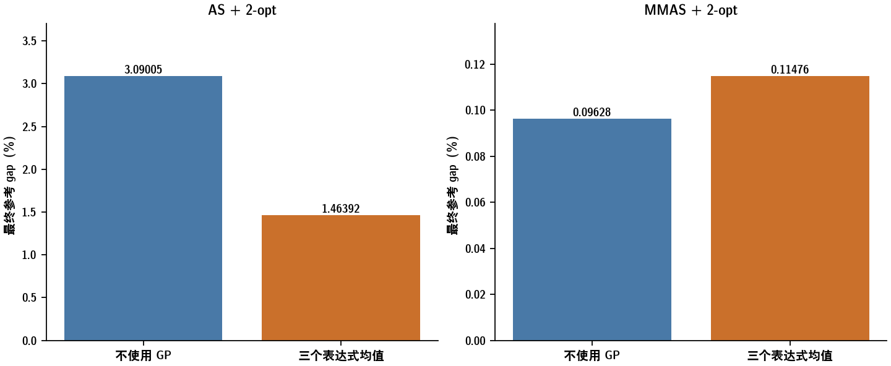
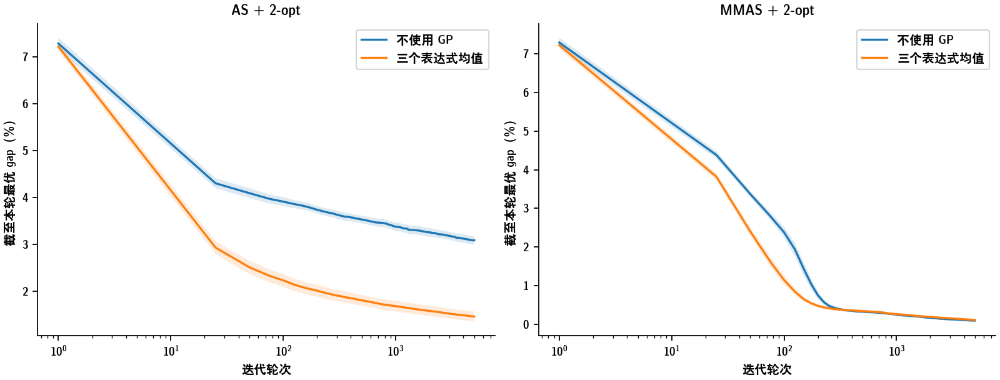
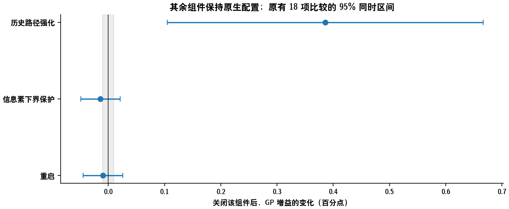
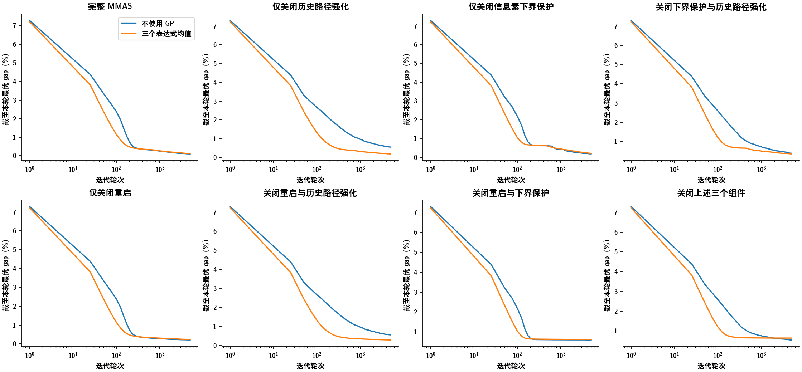
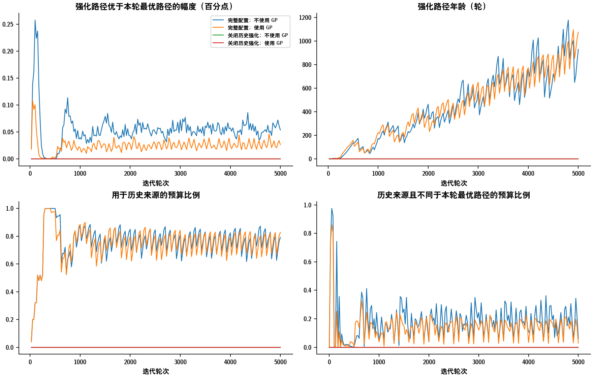
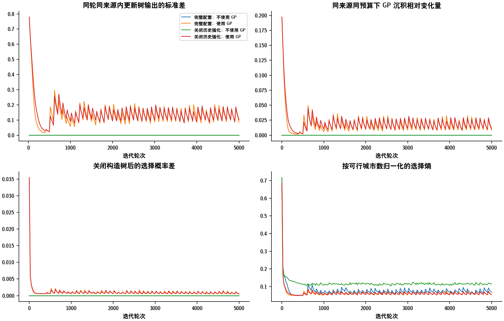
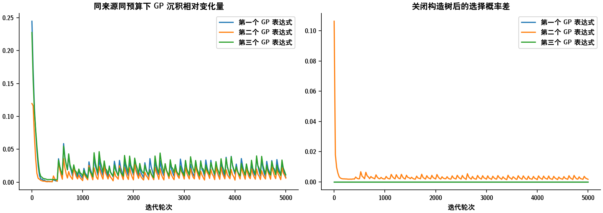
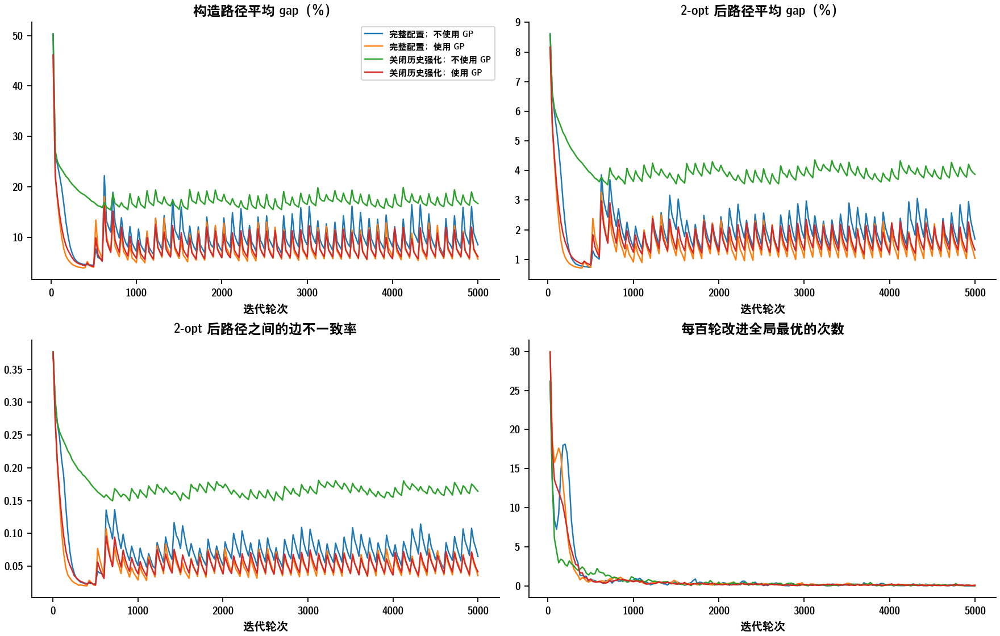
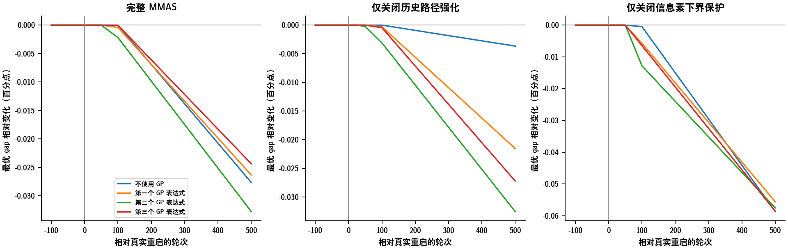

# MMAS 的哪些设计影响了 GP 在结合 2-opt 时的增量收益？

## 摘要与直接回答

现有组件干预中，最强证据指向**使用历史优良路径进行信息素强化**。在保留重启和信息素下界保护时，关闭历史路径强化，会使不使用 GP 的方法退化得更多，因而扩大 GP 的相对增益。单独关闭重启或下界保护，没有观察到同等幅度的增益变化。后两者的区间跨零，不代表它们没有作用。

关闭历史路径强化后，GP 增益增加 0.38566 个百分点，95% 同时区间为 [0.10470, 0.66662]。但不使用 GP 和使用 GP 的 gap 分别增加 0.46009 和 0.07443 个百分点。因此，这不是移除组件提高绝对质量的结果。

已有证据定位了一个重要组件，但尚未完整证明作用机制。历史强化与 GP 是否提供相似的边偏好、单路径强化是否限制 GP 的作用范围、2-opt 是否削弱两种策略间的结构差异，需要中间日志与同状态干预共同检验。报告不把这些解释写成已证实结论。

当前结论来自 32 个开发实例、5 个配对求解种子和每框架三个固定表达式。没有重新训练。独立确认和新增控制实验的结果尚未纳入。

## 1. 待解释的现象：增量收益不同，不等于绝对性能排序相同

| 框架 | 模型 | gap（%） | GP 带来的改进（百分点） | 胜 | 平 | 负 |
| --- | --- | --- | --- | --- | --- | --- |
| AS | 不使用 GP | 3.09005 | 0.00000 | 0 | 32 | 0 |
| AS | 第一个 GP 表达式 | 1.47834 | 1.61171 | 32 | 0 | 0 |
| AS | 第二个 GP 表达式 | 1.51042 | 1.57963 | 32 | 0 | 0 |
| AS | 第三个 GP 表达式 | 1.40300 | 1.68706 | 32 | 0 | 0 |
| AS | 三个 GP 表达式均值 | 1.46392 | 1.62613 | 32 | 0 | 0 |
| MMAS | 不使用 GP | 0.09628 | 0.00000 | 0 | 32 | 0 |
| MMAS | 第一个 GP 表达式 | 0.11667 | -0.02038 | 7 | 4 | 21 |
| MMAS | 第二个 GP 表达式 | 0.11176 | -0.01548 | 10 | 6 | 16 |
| MMAS | 第三个 GP 表达式 | 0.11585 | -0.01957 | 10 | 5 | 17 |
| MMAS | 三个 GP 表达式均值 | 0.11476 | -0.01848 | 6 | 6 | 20 |

AS 中 GP 改善了这些开发实例的平均质量。MMAS 的不使用 GP 对照本身已经更好，固定 GP 表达式的最终均值反而略差。两种框架使用了各自训练的表达式，蒸发率和强化来源也不同。因此，框架之间的这一结果本身不是单组件因果实验。

MMAS 中，使用 GP 的全过程平均最优 gap 为 0.25652%，不使用 GP 为 0.27226%。平均过程表现和最终结果的排序不同，不能写成 GP 在每个阶段都更差。阴影为实例级点态区间，不表示逐轮显著。

## 2. 实际实现与控制变量

所有运行都是 TSP500、32 只蚂蚁、5000 轮；构造和局部搜索候选数均为 20，每轮全部蚂蚁执行 ACOTSP 风格 2-opt。AS 的蒸发率为 0.5，MMAS 为 0.2；信息素与距离启发式指数分别为 1 和 2。两棵树的残差系数均为 1/3。

| 设计 | AS | MMAS |
| --- | --- | --- |
| 强化来源 | 本轮全部 32 条局部搜索后路径 | 每轮一条路径；按原生日程选择本轮最优、重启后最优或历史全局最优 |
| 信息素下界 | 没有 MMAS 下界保护 | 候选有向弧蒸发后执行下界保护 |
| 信息素硬上界 | 不执行 | 本研究使用的 2-opt 分支不执行硬上界裁剪 |
| 重启 | 不执行 MMAS 原生重启 | 重置信息素及重启周期的部分历史状态和时钟 |

实际更新顺序是：确定强化来源与预算 → 候选弧蒸发及下界保护 → 沉积 → 重启判断和执行。因此，不能解释成 GP 刚写入的沉积立即被本轮信息素下界裁掉。后续轮次下界和重启的作用需要另行分析。

关闭历史路径强化时仍只强化本轮最优的一条路径，并保留历史最优记录和原生影子来源的预算规则。它不是删除所有记忆，也不是把 MMAS 变成 AS。来源元数据来自实际强化路径，不来自预算参考路径。

两棵 GP 树改变的内容也必须区分。构造树调整当前可行城市的选择分数。更新树只重新分配给定来源路径内部的沉积，不选择强化来源，也不改变该来源的总沉积预算。对一条来源路径，其边上的沉积可写为：

\[\text{边的沉积}=\text{来源预算}\times\frac{\text{该边的权重}}{\text{来源路径上所有边的权重之和}}.\]

边权等于 1 加上更新树输出的双曲正切值的三分之一，范围为 2/3 到 4/3。关闭更新树后，同一来源的每条边均分预算。多来源时，各来源对同一边的沉积相加。因此，更新树不能直接强化所有来源都不包含的边。构造树仍可通过后续路径间接改变来源。这是当前 GP 的作用边界，不是单路径强化一定不利于 GP 的实验证明。

gap 等于 100 ×（路径长度／参考长度 − 1）。参考路径是可行参考解，不声称已证明最优。最终长度用 CPU FP64 重算。下文的 GP 增益等于不使用 GP 的 gap 减使用 GP 的 gap，正值代表改善。

## 3. 用组件干预定位差异

### 3.1 先比较完整配置附近的单组件变化

| 移除的组件 | 移除后 GP 增益的变化（百分点） | 同时区间下限 | 同时区间上限 |
| --- | --- | --- | --- |
| 重启 | -0.00974 | -0.04497 | 0.02549 |
| 信息素下界保护 | -0.01404 | -0.04890 | 0.02081 |
| 历史路径强化 | 0.38566 | 0.10470 | 0.66662 |

历史路径强化的移除效应大于另外两项的移除效应，原有同时比较支持这个条件下的差别。这定位的是完整配置附近的条件效应，不是所有背景下普遍不变的组件排名。

| 直接比较 | GP 增益变化之差（百分点） | 同时区间下限 | 同时区间上限 |
| --- | --- | --- | --- |
| 历史路径强化的移除效应减重启的移除效应 | 0.39540 | 0.12135 | 0.66946 |
| 历史路径强化的移除效应减下界保护的移除效应 | 0.39971 | 0.11783 | 0.68159 |

上表直接检验两个效应之差，不是用“一个显著、另一个不显著”代替效应大小比较。

### 3.2 检查绝对退化与组件交互

| 配置 | 重启 | 信息素下界保护 | 历史路径强化 | 不使用 GP 的 gap（%） | 使用 GP 的 gap（%） | GP 带来的改进（百分点） | 同时区间下限 | 同时区间上限 |
| --- | --- | --- | --- | --- | --- | --- | --- | --- |
| 完整 MMAS | 启用 | 启用 | 启用 | 0.09628 | 0.11476 | -0.01848 | -0.03455 | -0.00241 |
| 仅关闭历史路径强化 | 启用 | 启用 | 关闭 | 0.55637 | 0.18919 | 0.36718 | 0.09164 | 0.64272 |
| 仅关闭信息素下界保护 | 启用 | 关闭 | 启用 | 0.17747 | 0.21000 | -0.03252 | -0.06523 | 0.00018 |
| 关闭下界保护与历史路径强化 | 启用 | 关闭 | 关闭 | 0.38282 | 0.34747 | 0.03535 | -0.08824 | 0.15893 |
| 仅关闭重启 | 关闭 | 启用 | 启用 | 0.20781 | 0.23603 | -0.02822 | -0.06419 | 0.00775 |
| 关闭重启与历史路径强化 | 关闭 | 启用 | 关闭 | 0.56230 | 0.29505 | 0.26725 | -0.00690 | 0.54140 |
| 关闭重启与下界保护 | 关闭 | 关闭 | 启用 | 0.60323 | 0.62973 | -0.02651 | -0.08707 | 0.03405 |
| 关闭上述三个组件 | 关闭 | 关闭 | 关闭 | 0.54222 | 0.63742 | -0.09519 | -0.19779 | 0.00740 |

关闭历史路径强化后，GP 的 gap 为 0.18919%，仍差于完整 MMAS 不使用 GP 的 0.09628%。相对优势扩大主要对应对照方法退化更多，不能据此推荐删除历史强化。

| 比较 | 改进口径的交互效应（百分点） | 同时区间下限 | 同时区间上限 |
| --- | --- | --- | --- |
| 保留历史路径强化时，重启与下界的交互 | 0.01576 | -0.05864 | 0.09015 |
| 保留下界保护时，重启与历史强化的交互 | -0.09019 | -0.13085 | -0.04954 |
| 保留重启时，下界与历史强化的交互 | -0.31779 | -0.53699 | -0.09860 |
| 三个组件的交互 | -0.04636 | -0.13736 | 0.04464 |

下界保护与历史强化、重启与历史强化存在条件交互。三个组件全部关闭时，GP 没有保持关闭历史强化时的平均优势。因此，结论必须保留其他组件的背景条件。

这里的交互是：先计算关闭一个组件改变了多少 GP 增益，再比较另一个组件开启和关闭时，这一变化是否相同。例如，只关闭历史强化时 GP 的平均增益为 0.36718 个百分点；同时关闭下界保护后，这个增益为 0.03535 个百分点。不能忽略下界保护的背景作用。

## 4. 从中间记录检验作用过程

### 4.1 历史路径强化提供了怎样的路径来源？

| 过程指标 | 完整配置：不使用 GP | 关闭历史强化：不使用 GP | 完整配置：使用 GP | 关闭历史强化：使用 GP |
| --- | --- | --- | --- | --- |
| 强化路径优于本轮最优路径的幅度（百分点） | 0.05458 | 0.00000 | 0.02466 | 0.00000 |
| 强化路径年龄（轮） | 444.43703 | 0.00000 | 451.77576 | 0.00000 |
| 用于历史来源的预算比例 | 0.75691 | 0.00000 | 0.74394 | 0.00000 |
| 历史来源且不同于本轮最优路径的预算比例 | 0.17882 | 0.00000 | 0.13865 | 0.00000 |

来源优势为本轮最优路径长度减实际来源长度，再除参考长度并乘 100。正值表示强化来源比当前种群最优路径更好。多来源指标按实际沉积预算加权。历史标签与不同路径是两回事：表中另外列出历史来源确实不同于本轮最优路径的比例。

完整 MMAS 不使用 GP 时，历史来源获得 75.69% 的预算，但历史来源且与本轮最优路径不同的预算仅占 17.88%。历史记录可能与本轮重新找到的路径相同。因此，来源年龄大不能直接说明算法一直强化当前种群之外的旧路径。需要同时检查路径身份、边重合率和质量，才能区分历史来源标签与实际边集差异。

| 配置 | 模型 | 实际来源路径改变的轮次比例 | 窗口末尾已连续强化同一路径的轮数 |
| --- | --- | --- | --- |
| 完整 MMAS | 不使用 GP | 0.29740 | 82.72156 |
| 完整 MMAS | 三个 GP 表达式均值 | 0.22955 | 90.84625 |
| 仅关闭历史路径强化 | 不使用 GP | 0.74106 | 31.55128 |
| 仅关闭历史路径强化 | 三个 GP 表达式均值 | 0.27797 | 69.42873 |

来源切换通过实际来源路径的边集哈希比较，不用来源类型标签代替。连续强化轮数在每个 25 轮窗口末尾取值后平均，不是完整重复片段的平均持续时间。即使关闭历史强化，本轮种群也可能反复产生同一条最优路径，因而仍会连续强化同一路径。

### 4.2 GP 的输出是否变成了实际更新和选择差异？

| 过程指标 | 完整配置：不使用 GP | 关闭历史强化：不使用 GP | 完整配置：使用 GP | 关闭历史强化：使用 GP |
| --- | --- | --- | --- | --- |
| 同轮同来源内更新树输出的标准差 | 0.00000 | 0.00000 | 0.13673 | 0.14302 |
| 同来源同预算下 GP 沉积相对变化量 | 0.00000 | 0.00000 | 0.01851 | 0.02024 |
| 关闭构造树后的选择概率差 | 0.00000 | 0.00000 | 0.00110 | 0.00109 |
| 按可行城市数归一化的选择熵 | 0.07698 | 0.11919 | 0.06392 | 0.06467 |

同来源沉积变化量是实际沉积与关闭更新树后均匀源内沉积的边差绝对值之和，除以相同总预算。AS 的多个来源先合并到无向边再计算。构造概率差为同一保存上下文下，两组概率差绝对值之和的一半。关闭构造树的概率是保存基础分数的 CPU FP64 参考归一化，不是另一条实际运行轨迹。

输出饱和不等于 GP 没有作用；共同的边权倍数可能在预算归一化时抵消。三个表达式分开展示，避免总体平均掩盖零构造树或不同更新方式。

关闭历史强化前后，GP 的同来源沉积变化量为 0.01851 和 0.02024；固定上下文的构造概率差为 0.00110 和 0.00109。两种配置下都存在实际调整，其平均幅度没有出现与最终增益相当的突变。这不支持把现象简单解释为“历史强化使 GP 输出完全失效”。但这些量来自各自运行到达的状态，不能替代相同状态下的干预，也不能排除后续更新削弱调整。

### 4.3 局部搜索前后发生了什么？

| 过程指标 | 完整配置：不使用 GP | 关闭历史强化：不使用 GP | 完整配置：使用 GP | 关闭历史强化：使用 GP |
| --- | --- | --- | --- | --- |
| 构造路径平均 gap（%） | 10.36414 | 17.49620 | 7.99016 | 8.10958 |
| 2-opt 后路径平均 gap（%） | 2.05635 | 4.00830 | 1.55531 | 1.70601 |
| 2-opt 后本轮最优 gap（%） | 1.13381 | 2.43150 | 0.83722 | 0.98340 |
| 2-opt 后不同路径数量 | 21.46850 | 27.72463 | 18.69893 | 19.03591 |
| 构造路径之间的边不一致率 | 0.07075 | 0.16930 | 0.04444 | 0.04647 |
| 2-opt 后路径之间的边不一致率 | 0.07852 | 0.17037 | 0.05430 | 0.05635 |
| 每百轮改进全局最优的次数 | 1.09038 | 0.73037 | 1.05417 | 0.94008 |

路径之间的边不一致率衡量同一轮蚂蚁之间的多样性，不是 GP 与不使用 GP 之间的差异存活率。较小的 2-opt 改进可能来自更好的构造路径，也可能来自过早集中；必须与搜索后质量、路径多样性和后续改进共同解释。

关闭历史强化后，不使用 GP 的局部搜索后平均 gap 从 2.05635% 变为 4.00830%；使用 GP 时，从 1.55531% 变为 1.70601%。这把最终结果中的差异进一步定位到每轮局部搜索后的路径种群，而不只是最后一条最优路径。它仍是完整组件干预产生的过程变化，不能据此确定其中某个过程量是唯一中介。

### 4.4 为什么每轮路径更好，最终最优解却没有更好？

| 阶段 | 2-opt 后本轮最优 gap（%）；不使用 GP | 2-opt 后本轮最优 gap（%）；使用 GP | 2-opt 后不同路径数；不使用 GP | 2-opt 后不同路径数；使用 GP | 每百轮改进次数；不使用 GP | 每百轮改进次数；使用 GP |
| --- | --- | --- | --- | --- | --- | --- |
| 第 1–250 轮 | 2.63793 | 1.72726 | 29.62102 | 25.46818 | 14.52750 | 15.03750 |
| 第 251–1000 轮 | 0.94708 | 0.75931 | 19.91146 | 17.42201 | 1.30750 | 0.92472 |
| 第 1001–2500 轮 | 1.06078 | 0.80101 | 21.05594 | 18.27656 | 0.36083 | 0.31764 |
| 第 2501–5000 轮 | 1.08323 | 0.79331 | 21.28637 | 18.59081 | 0.11925 | 0.13658 |

完整 MMAS 中，使用 GP 的本轮最优路径在四个阶段的平均 gap 都更小，但 2-opt 后不同路径的数量也更少。最终成绩取 5000 轮中最好的一条路径，不取当前种群均值。较好的典型路径不保证出现更好的极端最优路径。这两个评价对象的区别，可以解释为什么仅查看训练中的平均过程指标会得出不完整判断。

第 251–1000 轮和第 1001–2500 轮，使用 GP 的全局最优改进次数更少。第 2501–5000 轮则略多。因此，不能概括成 GP 在所有阶段都更少改进，也不能仅用改进次数推断改进幅度。路径质量提高与多样性减少同时出现，与搜索过于集中这一解释相容，但尚不能证明多样性下降造成了最终退化。

要检验这个解释，需要从同一起点开关两棵树，观察差异能否经过 2-opt 保留，并比较后续最优质量。若同状态下质量差异与结构差异的变化不一致，就需要否定或修正该解释，而不能只根据相关曲线作结论。

### 4.5 历史强化移除后的配对过程变化

| 模型 | 指标 | 关闭历史强化后的变化 | 点态区间下限 | 点态区间上限 |
| --- | --- | --- | --- | --- |
| 不使用 GP | 2-opt 后本轮最优 gap（%） | 1.29769 | 1.01518 | 1.58715 |
| 三个 GP 表达式均值 | 2-opt 后本轮最优 gap（%） | 0.14618 | 0.12548 | 0.16898 |
| 不使用 GP | 每百轮改进全局最优的次数 | -0.36000 | -0.45063 | -0.27487 |
| 三个 GP 表达式均值 | 每百轮改进全局最优的次数 | -0.11408 | -0.13908 | -0.08892 |
| 不使用 GP | 2-opt 后路径之间的边不一致率 | 0.09186 | 0.07339 | 0.11060 |
| 三个 GP 表达式均值 | 2-opt 后路径之间的边不一致率 | 0.00205 | 0.00085 | 0.00338 |
| 不使用 GP | 同来源同预算下 GP 沉积相对变化量 | 0.00000 | -0.00000 | 0.00000 |
| 三个 GP 表达式均值 | 同来源同预算下 GP 沉积相对变化量 | 0.00172 | 0.00104 | 0.00249 |

上述区间按实例配对计算，为事后过程分析的点态区间，不继承组件分析的同时覆盖率。完整的[阶段统计](process_stages.csv)、[逐模型汇总](process_summary.csv)、[时间曲线数据](process_curves.csv)和[全部配对变化](process_paired_changes.csv)一并提供。阶段固定为 1–250、251–1000、1001–2500、2501–5000 轮。

### 4.6 为什么还需要在 AS 内做反向对照？

| 过程指标 | AS；不使用 GP | AS；使用 GP | MMAS；不使用 GP | MMAS；使用 GP |
| --- | --- | --- | --- | --- |
| 实际强化路径的平均 gap（%） | 7.68977 | 4.37086 | 1.07923 | 0.81256 |
| 强化路径优于本轮最优路径的幅度（百分点） | -2.29114 | -1.65382 | 0.05458 | 0.02466 |
| 2-opt 后本轮最优 gap（%） | 5.39863 | 2.71704 | 1.13381 | 0.83722 |
| 2-opt 后不同路径数量 | 32.00000 | 31.80833 | 21.46850 | 18.69893 |
| 同来源同预算下 GP 沉积相对变化量 | 0.00000 | 0.09369 | 0.00000 | 0.01851 |
| 关闭构造树后的选择概率差 | 0.00000 | 0.01409 | 0.00000 | 0.00110 |

原生 AS 强化全部当前路径，因此实际来源的预算加权平均质量差于本轮最优路径。原生 MMAS 使用单条择优路径，且部分轮次可以直接使用历史优良路径。这提供了一个具体解释方向：MMAS 在进入 GP 的边权分配之前，已经执行了更强的路径选择。

但是，这张跨框架表不能单独证明路径选择是原因。两种框架的来源数量、蒸发率和已学表达式都不同。因此，新增实验先在同一个框架内比较全部当前路径与单条当前最优路径，再比较单条当前路径与单条历史路径。六个表达式跨框架运行，以区分执行框架与表达式来源；不会把迁移结果等同于重新训练结果。

### 4.7 重启前后的实际改进

每条曲线以真实重启轮次为零点，先在每次求解内平均事件，再按实例平均。三个表达式分别列出。不同横坐标的可用事件数可能不同，[事件对齐统计](restart_aligned.csv)同时列出实例数和事件数。这是发生重启条件下的描述，不能把重启后下降的曲线直接解释成重启的因果收益。

## 5. 哪些解释还需要控制实验？

| 解释 | 当前证据 | 决定性补充 |
| --- | --- | --- |
| 历史强化为不使用 GP 的方法提供了更多质量改进，因此压缩 GP 的增量空间 | 组件干预支持收益差异；不是功能重叠的充分证据 | 固定状态改变强化来源；在 AS 内加入相同历史来源规则 |
| MMAS 只强化一条路径，限制了更新树的支持范围 | 现有历史来源消融始终是单路径，尚未分离数量 | 同框架比较全部当前路径与单条当前最优路径，匹配预算规则 |
| GP 的调整被归一化、后续下界保护或重启削弱 | 可测实际沉积；硬上界裁剪不是当前实现的解释 | 从相同完整状态比较开关更新树，逐阶段追踪信息素与选择概率 |
| 2-opt 削弱了 GP 与对照的结构差异 | 各自路径的边保留率不能回答这个问题 | 同状态、配对随机数下比较两种策略局部搜索前后的边集差异 |

新增实验按[冻结执行协议](../../MECHANISM_EXPLANATION.md)开展。开发阶段让六个固定表达式跨框架运行；同状态实验保留局部搜索前后结构和 500 轮续跑；独立确认使用 128 个实例、10 个求解种子。这些结果未完成前，不把计划写成证据。

## 6. 结论

第一，在已经完成的开发集组件实验中，历史优良路径强化是影响固定 GP 相对增益最明显的已测组件。这一结论成立于当前 MMAS 配置附近，不能忽略与下界保护、重启的交互。

第二，关闭历史强化没有提高 GP 的绝对质量。它主要使不使用 GP 的方法退化更多。因此，目前更准确的表述是该组件减少了这些已学表达式的增量收益，而不是该组件本身有害。

第三，中间日志表明，历史强化移除后的差异已经出现在每轮局部搜索后的路径质量和种群结构中。完整 MMAS 中，GP 同时伴随较好的典型路径与较低的路径多样性。这些结果将机制问题缩小到路径来源选择、边权调整与后续搜索之间的关系，但还没有证明某一个过程量是最终差异的唯一原因。

最后，现有结果不能证明所有 GP 规则都不适合 MMAS，也不能证明重新训练无效。具体作用过程、来源数量的独立作用和 AS 反向干预仍需与新增对照结果一起判断。

据此，下一步应优先检验强化来源的选择方式及其与更新树的配合，而不是直接删除重启或下界保护。本报告尚不支持宣称学习来源选择一定优于固定规则，也不把扩大 GP 相对增益当作提高绝对求解质量。

## 附录：统计、数值环境与复现范围

实例是统计单位。每实例先平均 5 个求解种子，再平均三个固定表达式。不使用 GP 的对照只有一份。胜平负以 ±0.01 个百分点划分；误差区间跨零不等于证明无作用。组件结果保留原有 18 项比较的 30,000 次配对 bootstrap 同时区间。

本报告上述已完成的组件结果来自原数值实现。原实现存在近常量终端输入的数值稳定性问题。稳定修正已通过独立输入核验，但没有改善旧表达式的平均质量；这不是稳定输入下重新训练的实验。新增正式对照采用中心化 FP32，原实现与稳定实现的结果不得混合。

新增跨框架验收还发现，500 条来源边的 FP32 顺序累加可产生小幅均值偏移。首次验收有 13 个未被对应表达式使用的输入超过既定阈值，最大误差为 2.115716×10⁻⁵。该批次已暂停并保留。后续实现采用显式舍入的补偿求和，不改变终端数学定义或误差阈值，并重新执行逐型号验收。此修改以独立批次和源码哈希区分，不回写已有质量结果。

三个 MMAS 表达式在历史部署检查中均未通过，因此这里报告的是未回退表达式的机制结果，而不是回退部署策略的质量。

[原始完整报告与核验记录](../numerical-v1-original/report_zh.md)保留旧发布版本，供审计使用；正文及新图不再使用内部组件简称。

报告生成时间：2026-09-17T14:18:08.673170+00:00。
