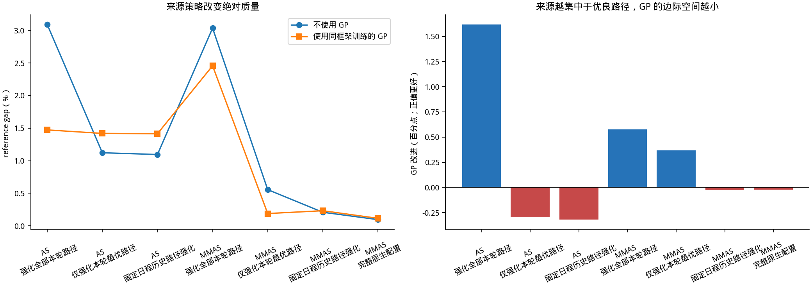
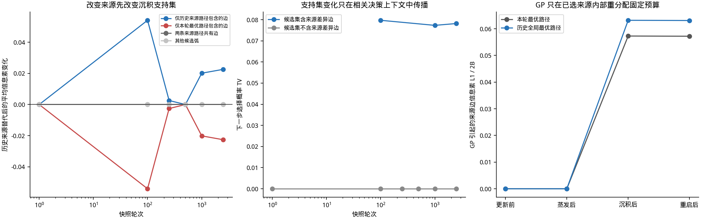
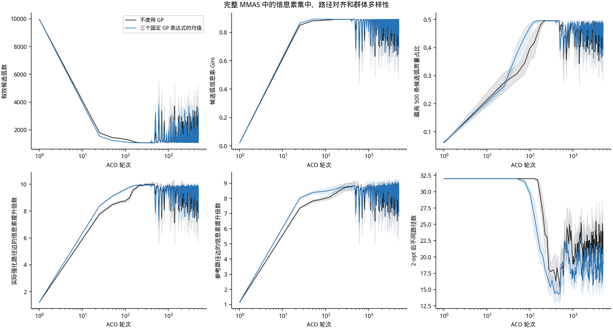
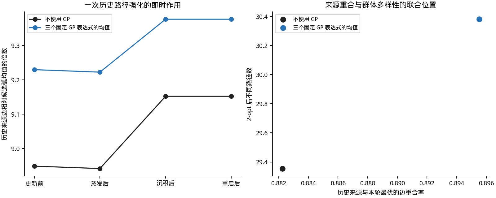
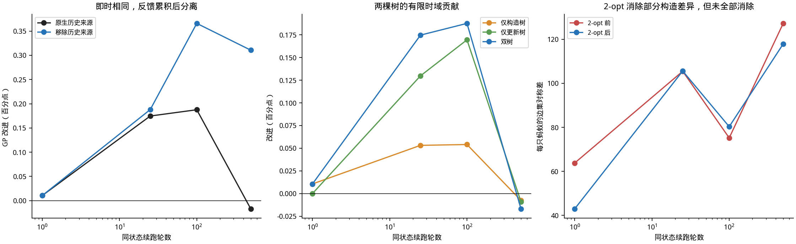
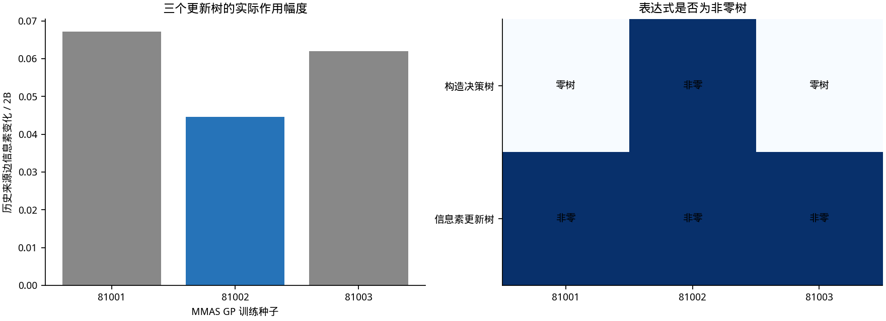

# MMAS 与 2-opt 中历史路径强化为何压缩 GP 的边际收益

## 直接回答

当前开发集和同状态实验指向同一个主因：不是重启，也不是信息素下界保护。主因是强化来源的选择。完整 MMAS 会按日程反复选择历史优良路径。这个步骤先决定沉积可以落在哪些边上。GP 信息素树随后只能在这些已选边内部重分配固定预算。它不能把预算移到来源路径之外。

当框架从“强化全部本轮路径”改为“只强化一条本轮最优路径”时，baseline 已显著增强，GP 的边际空间同时缩小。再改为历史优良路径强化后，baseline 进一步增强，GP 增益接近零或变为负值。这个模式在 AS 和 MMAS 内部都出现。因此，结果不能只归因于 MMAS 这个名称。它来自优良路径来源选择和重复反馈。

早期八格控制实验中，关闭历史路径强化使 GP 增益增加 0.38566 个百分点，95% 同时区间为 [0.10470, 0.66662]。关闭重启的变化为 -0.00974 [-0.04497, 0.02549]。关闭信息素下界保护的变化为 -0.01404 [-0.04890, 0.02081]。历史路径强化的移除效应显著大于另外两项。该结果来自开发集，不是尚未运行的独立确认集。

## 作用链

设本轮被框架选中的来源边集为 $S_t$。不使用 GP 时，来源内部使用均匀权重。使用 GP 时，每条来源边的权重为

\[w_e=1+\frac{1}{3}\tanh(g(e)),\qquad e\in S_t.\]

固定总预算 $B_t$ 后，实际沉积为

\[D_t(e)=B_t\frac{w_e}{\sum_{j\in S_t}w_j},\qquad e\in S_t.\]

对 $e\notin S_t$，$D_t(e)=0$。因此，框架先决定支持集 $S_t$。GP 只决定支持集内的比例。完整 MMAS 反复选择重启阶段最优或全局最优路径。相同优良边被多次强化。信息素集中后，这些边更可能进入下一轮路径。2-opt 又把较好的构造路径映射到局部最优解。新的优良解随后进入历史记忆。这个循环构成正反馈。

单次历史来源替换的全矩阵平均变化很小，因为 TSP500 有约 25 万条有向弧，而两条优良路径通常共享大部分边。当前同状态结果中，历史路径与本轮最优路径的平均边重合率约为 0.9714。每条路径平均约有 14.3 条边不被另一条路径共享；早期差异最大的快照约有 61.8 条。变化集中在这些边和包含这些边的构造上下文中。全矩阵相对 L1 会稀释这种局部作用。报告因此同时给出来源边局部变化和受影响上下文的概率 TV。

同状态起点下，1 轮后的原生来源与仅本轮最优来源几乎没有质量差异。续跑 500 轮后，移除历史来源使 GP 增益增加 0.32748 个百分点。这说明主要作用不是一次大跳变，而是来源选择、信息素和后续路径之间的累积反馈。

## 最终质量来源对照

GP 增益定义为同条件不使用 GP 的 gap 减使用 GP 的 gap。正值表示 GP 更好。每个实例先平均 5 个 ACO 种子和三个固定表达式。表中是 32 个开发实例。

| 执行配置 | 表达式来源 | 不使用 GP 的 gap（%） | 使用 GP 的 gap（%） | GP 改进（百分点） | 胜 | 平 | 负 |
| --- | --- | --- | --- | --- | --- | --- | --- |
| AS：强化全部本轮路径 | AS 训练的三个表达式 | 3.09005 | 1.47272 | 1.61733 | 32 | 0 | 0 |
| AS：仅强化本轮最优路径 | AS 训练的三个表达式 | 1.12228 | 1.41935 | -0.29707 | 1 | 1 | 30 |
| AS：固定日程历史路径强化 | AS 训练的三个表达式 | 1.09538 | 1.41458 | -0.31921 | 0 | 0 | 32 |
| MMAS：强化全部本轮路径 | MMAS 训练的三个表达式 | 3.03483 | 2.45688 | 0.57795 | 32 | 0 | 0 |
| MMAS：仅强化本轮最优路径 | MMAS 训练的三个表达式 | 0.55637 | 0.18964 | 0.36673 | 21 | 5 | 6 |
| MMAS：固定日程历史路径强化 | MMAS 训练的三个表达式 | 0.20936 | 0.23286 | -0.02350 | 12 | 3 | 17 |
| MMAS：完整原生配置 | MMAS 训练的三个表达式 | 0.09628 | 0.11631 | -0.02002 | 5 | 9 | 18 |

## 哪个 MMAS 组件造成主要差异

| 移除的组件 | GP 增益变化（百分点） | 同时区间下限 | 同时区间上限 |
| --- | --- | --- | --- |
| 重启 | -0.00974 | -0.04497 | 0.02549 |
| 信息素下界保护 | -0.01404 | -0.04890 | 0.02081 |
| 历史路径强化 | 0.38566 | 0.10470 | 0.66662 |

| 直接比较 | 效应差（百分点） | 同时区间下限 | 同时区间上限 |
| --- | --- | --- | --- |
| 历史路径强化的移除效应减重启的移除效应 | 0.39540 | 0.12135 | 0.66946 |
| 历史路径强化的移除效应减下界保护的移除效应 | 0.39971 | 0.11783 | 0.68159 |

这组控制实验支持“历史路径强化是主要组件”的判断。它不支持“重启是主因”或“下界保护是主因”。重启和下界仍可能改变绝对质量与长期状态，但当前固定表达式的边际收益差主要由来源策略解释。

## 同状态即时干预

左图将边分为历史来源特有、本轮最优特有、共有和其他候选弧。中图只在候选集中含来源差异边时计算主要概率响应。右图比较同一来源、同一预算下关闭和启用 GP 更新树。它们分别回答两个问题：框架选择哪条路径，以及 GP 如何在该路径内分配预算。

## 长期信息素和群体行为

| 轮次 | 规则 | 有效候选弧数 | 来源边提升倍数 | 参考路径边提升倍数 | 2-opt 后不同路径数 |
| --- | --- | --- | --- | --- | --- |
| 100 | 不使用 GP | 1318.17000 | 8.74900 | 8.00500 | 32.00000 |
| 100 | 三个固定 GP 表达式的均值 | 1129.31000 | 9.60900 | 8.46900 | 29.75000 |
| 500 | 不使用 GP | 1816.97000 | 9.23500 | 8.22000 | 15.29000 |
| 500 | 三个固定 GP 表达式的均值 | 3181.18000 | 7.85900 | 6.97600 | 14.44000 |
| 2500 | 不使用 GP | 2221.97000 | 8.67700 | 7.79200 | 19.54000 |
| 2500 | 三个固定 GP 表达式的均值 | 2701.47000 | 8.25600 | 7.45400 | 18.54000 |
| 5000 | 不使用 GP | 1847.51000 | 9.02900 | 8.19500 | 18.96000 |
| 5000 | 三个固定 GP 表达式的均值 | 3073.92000 | 7.88300 | 7.11900 | 20.15000 |

第 100 轮，GP 条件的来源边提升更高，有效候选弧更少，2-opt 后不同路径也更少。第 500 轮及以后，该方向会随重启和状态反馈改变。GP 不是单向加强信息素集中。它改变的是各阶段的集中—释放轨迹。自然轨迹可以说明这种时变行为，但不能单独识别因果效应。因果方向主要由同状态干预提供。

## 2-opt 是否抹去 GP 的作用

2-opt 会减少构造路径之间的边集差异。它没有在所有状态和时域中完全消除差异。最终最好解是极值统计。平均构造质量或平均 2-opt 后质量改善，不保证最终极值一定改善。完整 MMAS baseline 已很强时，这个差别更明显。

## 三个固定表达式

| 训练种子 | 构造决策树非零 | 信息素更新树非零 | 用于动画 | 历史来源边变化 / 2B | 通过非劣门槛 | 最终部署 |
| --- | --- | --- | --- | --- | --- | --- |
| 81001 | False | True | False | 0.06712 | False | False |
| 81002 | True | True | True | 0.04465 | False | False |
| 81003 | False | True | False | 0.06204 | False | False |

动画固定使用种子 81002，因为它是三个 MMAS 冠军中唯一两棵树都非零的表达式。这个选择只服务于可视化。静态汇总保留三个表达式。三个原始冠军均未通过训练时的非劣选择门槛，也未成为最终部署策略。因此，这里分析的是固定原始表达式的机制，不是已部署策略。

## 交互可视化

[打开离线交互页面](mechanism_dashboard.html)。页面可以切换四种来源策略、baseline/GP、轮次和四个更新阶段。空间图显示高信息素候选弧及实际来源、本轮最优和历史全局最优路径。热图按参考路径顺序重排。

## 结论边界

现有证据可以支持以下结论：完整 MMAS 中历史优良路径的来源选择和重复强化，显著压缩了固定 GP 规则的边际改进空间。GP 更新树的作用域受来源路径限制。单轮局部变化通过后续选择和局部搜索反馈累积。

现有证据不能证明该机制对所有实例分布、重新训练后的规则或未知 GP 表达式都成立。280 项独立确认仍因共享盘空间不足暂停。报告没有使用其不完整子集。动画是说明性个案，不是统计证明。

## 产物

- `source_policy_performance.csv`：来源策略最终质量。
- `same_state_source_support_per_instance.csv`：来源支持集的即时信息素变化。
- `same_state_probability_per_instance.csv`：受影响和未受影响构造上下文。
- `same_state_update_tree_per_instance.csv`：同来源同预算下的 GP 更新树作用。
- `pheromone_trajectory_per_instance.csv`：信息素集中与路径对齐轨迹。
- `continuation_quality_per_instance.csv`：同状态 1、25、100、500 轮续跑。
- `two_opt_survival_per_instance.csv`：2-opt 前后结构差异。
- `verification.json`：完整性和范围核验。
