# MMAS–2-opt 中固定 GP 策略的收益与机制：开发集受控实验报告

生成时间：2026-09-17T05:26:17.153024+00:00。实验批次：`numerical-v1`。状态：质量结果及完整诊断文件核验通过。

## 摘要

本报告分析 32 个 Uniform TSP500 实例。每个实例运行 5 个 ACO seeds。每个框架固定三个已训练冠军。所有质量实验使用 32 只蚂蚁、5000 轮和 ACOTSP 风格 2-opt。这里没有新训练，也没有使用确认集。

AS 的固定 GP 冠军明显降低了本开发集上的平均 reference gap。MMAS 的原始冠军均值略差于其 baseline。中心化数值修正通过了独立输入核验，但旧冠军的平均解质量没有因此改善。这个结果不回答修正后重新训练能否提高质量。

在历史实现中，移除历史路径强化来源 H 后，GP 相对 baseline 的净差改变 -0.38566 个百分点，95% 同时区间为 [-0.66662, -0.10470]。但 baseline 的 gap 增加 0.46009，GP 的 gap 也增加 0.07443。因此，相对优势主要扩大于 baseline 退化更多，而不是 GP 绝对质量提高。

本结果只支持开发集、固定冠军和历史实现下的干预效应。它不能证明历史强化与 GP 功能重叠，也不能证明 GP 可以替代局部搜索。

## 1. 动机与实验对象

研究问题是：为什么同一类可学习残差在 AS+2-opt 中有较大收益，在 MMAS+2-opt 中收益有限？本轮将数值环境与 MMAS 组件分开干预。前者检查 terminal 计算的影响。后者估计重启、信息素下界和历史路径来源对 GP 净收益的影响。

### 1.1 固定配置

| 项目 | 设置 |
| --- | --- |
| 数据 | 32 个新 Uniform TSP500 开发实例；5 个共同 ACO seeds；配对单位为实例 |
| 模型 | 每框架固定 raw 冠军 81001、81002、81003；不在本数据上重新选择 |
| ACO | 32 ants；5000 iterations；alpha=1，beta=2；AS rho=0.5，MMAS rho=0.2 |
| 候选与局部搜索 | construction candidate=20；LS candidate=20；ACOTSP 2-opt + DLB；每轮全部蚂蚁 |
| GP 集成 | TR residual；PH budget_residual；两者 gamma=1/3；来源预算匹配 |
| 数值后端 | cuda_tiled_v2；fp32_fast 搜索；最终路径长度用 CPU FP64 重算 |
| 数值对照 | legacy / centered_fp32 / centered_fp64；后者仅统计与归一化使用 FP64 |
| 本轮任务 | 18 个型号/数值验收 + 40 个三模式配对任务 + 40 个历史八格任务 = 98 |

数值对照含 3840 个逻辑求解。八格实验含 5120 个逻辑求解。两类实验有共同配置，不能将其简单相加作为独立样本量。主分析每项只有 32 个配对实例。

### 1.2 R/F/H 的定义

| 开关 | 1 | 0 |
| --- | --- | --- |
| R | 原生重启写操作 | 关闭重启；不删除全部历史信息 |
| F | 候选有向弧蒸发后的物理信息素下界 | 取消物理 floor；保留标称范围与 TauHeadroom 定义 |
| H | 原生 IB/RB/GB 路径来源日程 | 实际强化只用 iteration-best 边；仍按原生影子来源匹配总预算 |

条件名 C111 的三个位置依次是 R、F、H。原生 MMAS–LS 分支没有硬 tau_max 上界裁剪。H=0 不是完全无记忆算法。实际来源元数据与影子预算来源分开处理。AS 的 native 来源为 32 只当前蚂蚁，不是 32 条 iteration-best 路径。

## 2. 指标、统计单位与不确定性

\[g=100(L/L_{\mathrm{ref}}-1),\qquad \Delta=g_{GP}-g_{baseline}.\]

参考长度来自可行参考路径，在连续欧氏距离下用 FP64 重算。它不是已证明的最优值。gap 越小越好，负值保留。Δ 以百分点（pp）计，负值表示 GP 更好。

先在每个实例内平均 5 个 ACO seeds。三个固定冠军分别列出，整体结果再对冠军等权平均。baseline 只保留一份。重采样时整块抽取实例，同时保留所有条件及模型的配对关系。

八格主比较包含三个移除效应、三个效应大小差、三个二阶交互、一个三阶交互和八个 Δ，共 18 项。使用 30,000 次 bootstrap max-t；seed=2026091701；报告 95% 同时区间。每冠军附表分别校正自己的 18 项，不声称三位冠军合起来具有整体 95% 覆盖率。

数值对照、主结果描述及曲线采用 10,000 次实例 bootstrap 的点态区间，seed=2026091702。它们不是多重比较校正后的区间。实际意义阈值为 0.01 pp。区间不含零不等于整个区间超过该阈值；不显著也不等于无作用。

AUC 是 5000 个 incumbent gap 的等权平均，不是另一次短预算运行。曲线长度来自 GPU FP32 incumbent，最终表中路径长度经过 CPU FP64 重算，因此末点允许微小舍入差。胜/平/负先对实例内 seeds 求平均，再以 ±0.01 pp 分类。最差 10% 指按 Δ 排序最大的 4 个实例均值。

## 3. RQ1：固定冠军相对 baseline 的表现

| 框架 | 模型 | gap (%) | Δ (pp) | 点态下限 | 点态上限 | 平均 incumbent gap | 胜 | 平 | 负 |
| --- | --- | --- | --- | --- | --- | --- | --- | --- | --- |
| as | baseline | 3.09005 | 0.00000 | 0.00000 | 0.00000 | 3.28186 | 0 | 32 | 0 |
| as | 81001 | 1.47834 | -1.61171 | -1.69732 | -1.52709 | 1.61737 | 32 | 0 | 0 |
| as | 81002 | 1.51042 | -1.57963 | -1.67479 | -1.48536 | 1.67822 | 32 | 0 | 0 |
| as | 81003 | 1.40300 | -1.68706 | -1.77857 | -1.59548 | 1.55564 | 32 | 0 | 0 |
| as | GP_mean | 1.46392 | -1.62613 | -1.70756 | -1.54565 | 1.61708 | 32 | 0 | 0 |
| mmas | baseline | 0.09628 | 0.00000 | 0.00000 | 0.00000 | 0.27226 | 0 | 32 | 0 |
| mmas | 81001 | 0.11667 | 0.02038 | 0.00658 | 0.03421 | 0.25778 | 7 | 4 | 21 |
| mmas | 81002 | 0.11176 | 0.01548 | 0.00037 | 0.03126 | 0.25115 | 10 | 6 | 16 |
| mmas | 81003 | 0.11585 | 0.01957 | 0.00297 | 0.03721 | 0.26063 | 10 | 5 | 17 |
| mmas | GP_mean | 0.11476 | 0.01848 | 0.00691 | 0.02988 | 0.25652 | 6 | 6 | 20 |

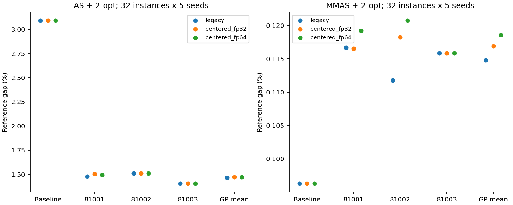

图 1：不同数值模式的最终 gap。冠军是离散模型，不用连接线暗示连续关系。

AS 与 MMAS 主表是各自原生参数下的结果比较，不是仅改变一个组件的实验。两者的信息素更新、来源数量、rho 等不同，不能把全部质量差都归因于某一个 MMAS 机制。

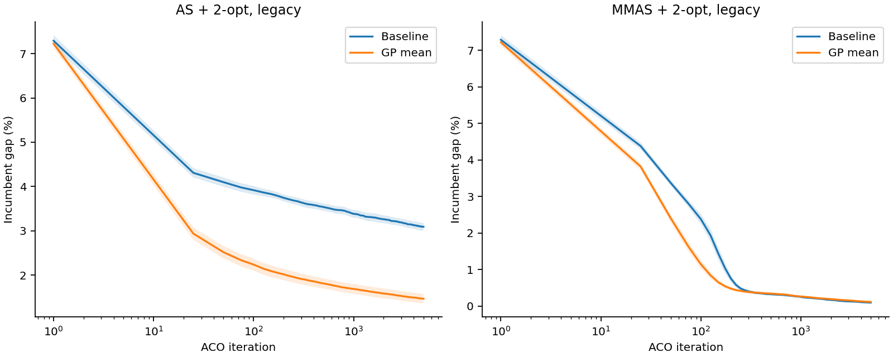

图 2：legacy 原配置的 incumbent 曲线。横轴为同一次 5000 轮运行的迭代数。阴影为实例级点态 95% 区间，不表示逐轮显著性。

MMAS 原配置还存在最终质量与全过程平均值的差别：GP 的平均 incumbent gap 为 0.25652%，baseline 为 0.27226%。GP 的该均值较低，但最终 gap 较高。不能把最终劣势写成全过程都更差。这个均值按迭代数计算，不是按实际耗时计算，因此也不能直接宣称等时间预算下更好。

三个 MMAS raw 冠军在历史训练选择中的部署 gate 均未通过，因此主表不能称为实际回退部署策略的表现。下表单列冻结的 legacy 部署决策。新数值模式没有重新验收部署 gate。

| 框架 | 历史部署策略 | gap (%) |
| --- | --- | --- |
| as | raw champions | 1.46392 |
| mmas | baseline fallback | 0.09628 |

## 4. RQ2：数值修正是否改善旧冠军

legacy 用 FP32 二阶原点矩计算方差。接近常量的输入可能出现消去误差。中心化实现先平移输入，再计算均值与中心化平方差；接近的信息素使用稳定的 log 比值。修正没有删除 terminal，没有增大保护 epsilon，也没有改动残差范围。

| 框架 | 数值模式 | GP 均值 gap (%) | 相对 legacy (pp) | 点态下限 | 点态上限 |
| --- | --- | --- | --- | --- | --- |
| as | legacy | 1.46392 | 0.00000 | 0.00000 | 0.00000 |
| as | centered_fp32 | 1.47198 | 0.00806 | -0.00194 | 0.01816 |
| as | centered_fp64 | 1.46886 | 0.00494 | -0.00647 | 0.01592 |
| mmas | legacy | 0.11476 | 0.00000 | 0.00000 | 0.00000 |
| mmas | centered_fp32 | 0.11687 | 0.00211 | -0.00434 | 0.00892 |
| mmas | centered_fp64 | 0.11859 | 0.00383 | -0.00309 | 0.01156 |

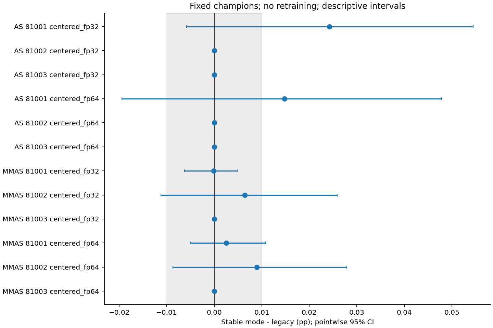

图 3：每位固定冠军的配对变化。三种模式的 baseline 最终 tour、anytime、长度和 gap 已核验一致。所有冠军的模式对照见 [完整数值表](numerical_effects.csv)。

三个 GPU 型号上的稳定模式均通过已保存输入的 FP64 oracle。legacy 通过的是历史轨迹等价检查，并不表示其 terminal 数学值正确。元素级失败次数不是独立样本数，详见 [逐 terminal 核验表](terminal_oracle.csv)。

观察上，修正后的冠军均值没有改善。点态区间仍包含零，不能声称稳定模式导致统计显著的质量下降。旧冠军是在旧数值环境中选择的；本轮不能判断稳定环境中重新训练的上限。

## 5. RQ3：R/F/H 如何影响 GP 净收益

### 5.1 全部八格与绝对变化

| 条件 | baseline gap | GP gap | Δ (pp) | 同时下限 | 同时上限 | baseline 相对 C111 | GP 相对 C111 |
| --- | --- | --- | --- | --- | --- | --- | --- |
| C111 | 0.09628 | 0.11476 | 0.01848 | 0.00241 | 0.03455 | 0.00000 | 0.00000 |
| C110 | 0.55637 | 0.18919 | -0.36718 | -0.64272 | -0.09164 | 0.46009 | 0.07443 |
| C101 | 0.17747 | 0.21000 | 0.03252 | -0.00018 | 0.06523 | 0.08119 | 0.09523 |
| C100 | 0.38282 | 0.34747 | -0.03535 | -0.15893 | 0.08824 | 0.28653 | 0.23271 |
| C011 | 0.20781 | 0.23603 | 0.02822 | -0.00775 | 0.06419 | 0.11153 | 0.12127 |
| C010 | 0.56230 | 0.29505 | -0.26725 | -0.54140 | 0.00690 | 0.46602 | 0.18029 |
| C001 | 0.60323 | 0.62973 | 0.02651 | -0.03405 | 0.08707 | 0.50694 | 0.51497 |
| C000 | 0.54222 | 0.63742 | 0.09519 | -0.00740 | 0.19779 | 0.44594 | 0.52266 |

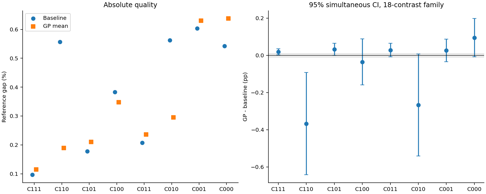

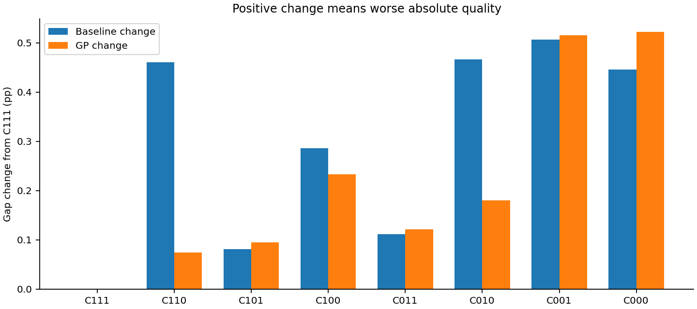

图 4–5：同条件相对差和相对 C111 的绝对变化。绝对变化为正表示退化。不能将削弱 baseline 后的相对优势解释成改进算法。

C111 的 GP 净差为 0.01848 pp，同时区间为 [0.00241, 0.03455]。区间不含零，但跨越 0.01 pp 阈值，因此不能说已经确认超过预设实际意义阈值的劣化。

移除 H 的 C110 中，GP gap 为 0.18919%，仍差于完整 baseline 的 0.09628%。H 对 baseline 的绝对收益大于对当前 GP 的收益。这个差异可以解释相对优势变化，但不能直接证明功能重叠。

### 5.2 条件效应与交互

\[E_H=\Delta_{110}-\Delta_{111},\quad E_R=\Delta_{011}-\Delta_{111},\quad E_F=\Delta_{101}-\Delta_{111}.\]

这些是原配置附近的条件移除效应，不是跨所有背景平均的普遍因素排名。二阶项采用差上差，三阶项比较两种 H 背景下的 R×F 差上差。精确符号由 [统计代码](../../statistics.py) 固定。

| 对比 | 均值 (pp) | 同时下限 | 同时上限 | 实际意义判断 |
| --- | --- | --- | --- | --- |
| E_R | 0.00974 | -0.02549 | 0.04497 | 精度不足或跨阈值 |
| E_F | 0.01404 | -0.02081 | 0.04890 | 精度不足或跨阈值 |
| E_H | -0.38566 | -0.66662 | -0.10470 | 实际负效应 |
| E_R-E_F | -0.00430 | -0.05396 | 0.04535 | 精度不足或跨阈值 |
| E_R-E_H | 0.39540 | 0.12135 | 0.66946 | 实际正效应 |
| E_F-E_H | 0.39971 | 0.11783 | 0.68159 | 实际正效应 |
| J_RF\|H=1 | -0.01576 | -0.09015 | 0.05864 | 精度不足或跨阈值 |
| J_RH\|F=1 | 0.09019 | 0.04954 | 0.13085 | 实际正效应 |
| J_FH\|R=1 | 0.31779 | 0.09860 | 0.53699 | 实际正效应 |
| J_RFH | 0.04636 | -0.04464 | 0.13736 | 精度不足或跨阈值 |
| Delta_C111 | 0.01848 | 0.00241 | 0.03455 | 精度不足或跨阈值 |
| Delta_C110 | -0.36718 | -0.64272 | -0.09164 | 实际负效应 |
| Delta_C101 | 0.03252 | -0.00018 | 0.06523 | 精度不足或跨阈值 |
| Delta_C100 | -0.03535 | -0.15893 | 0.08824 | 精度不足或跨阈值 |
| Delta_C011 | 0.02822 | -0.00775 | 0.06419 | 精度不足或跨阈值 |
| Delta_C010 | -0.26725 | -0.54140 | 0.00690 | 精度不足或跨阈值 |
| Delta_C001 | 0.02651 | -0.03405 | 0.08707 | 精度不足或跨阈值 |
| Delta_C000 | 0.09519 | -0.00740 | 0.19779 | 精度不足或跨阈值 |

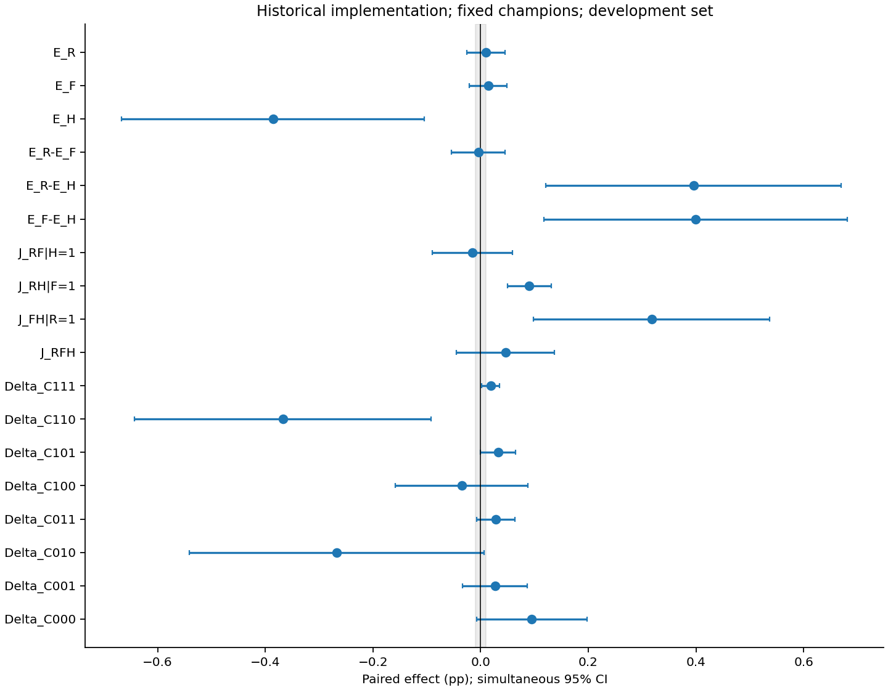

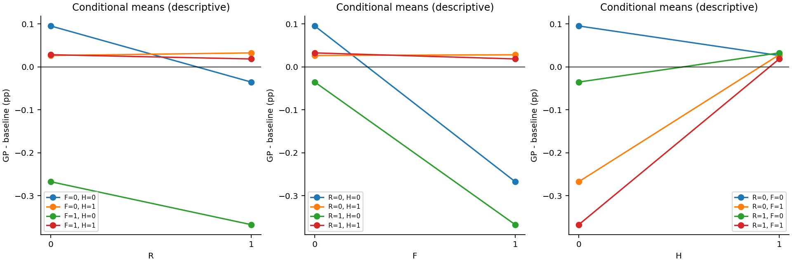

图 6–7：18 项同时区间和条件均值。H 的移除效应及其与 R、F 的交互需要共同解释。R 或 F 的单项区间跨零不能用于排除它们的重要性。

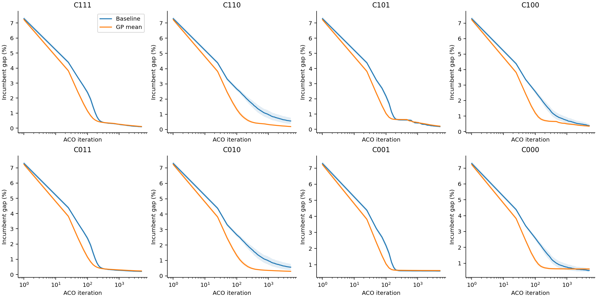

图 8：八格 incumbent 曲线。全部条件都展示；没有根据结果挑选条件。每冠军的 18 项区间见 [附表](per_champion.csv)。

### 5.3 实例异质性与尾部表现

| 条件 | 胜 | 平 | 负 | 最差4实例 Δ (pp) | baseline AUC | GP AUC |
| --- | --- | --- | --- | --- | --- | --- |
| C111 | 6 | 6 | 20 | 0.07838 | 0.27226 | 0.25652 |
| C110 | 22 | 5 | 5 | 0.05709 | 0.86805 | 0.32824 |
| C101 | 7 | 6 | 19 | 0.16089 | 0.38396 | 0.39076 |
| C100 | 10 | 3 | 19 | 0.14179 | 0.66883 | 0.48884 |
| C011 | 10 | 5 | 17 | 0.15389 | 0.34136 | 0.33303 |
| C010 | 14 | 1 | 17 | 0.22116 | 0.86989 | 0.39355 |
| C001 | 10 | 2 | 20 | 0.21875 | 0.68254 | 0.67976 |
| C000 | 5 | 0 | 27 | 0.28928 | 0.76057 | 0.69077 |

例如 C100 的平均 Δ 为负，但负例数多于胜例数。均值优势不能解释成大多数实例都改善。尾部值描述风险，不是新增的显著性检验。

## 6. RQ4：诊断轨迹提供什么解释线索

### 6.1 定义与汇总口径

PH 饱和率为全部实际来源边中 |tanh(raw)|≥0.99 的比例，每 25 轮合并。raw 是经过现有数值保护的 GP 输出。TR 熵来自固定的 4 只蚂蚁×4 个构造位置，只代表这些探针。来源年龄按实际强化路径的生成轮次计算。

窗口 tanh 标准差合并了边与轮次，包含时间变化，不是纯粹的源内空间差异。实际源内重加权另由下面的 AD 衡量。

\[AD=\frac{\sum_e|D_{GP}(e)-D_0(e)|}{B}.\]

AD 比较相同实际来源、相同总预算 B 下的 GP 沉积与均匀来源内沉积。本八格 MMAS 每轮只有一个实际来源。AD 是保存来源上的局部 PH 变化，不是另一条 baseline 轨迹的因果效应。LS 保留率为同一只蚂蚁的构造边在 2-opt 后仍保留的比例，不是 baseline 与 GP 之间的差异存活率。

| 条件 | 来源年龄 | 来源切换率 | PH 饱和率 | tanh 标准差 | AD | 2-opt 平均改善 (pp) | 构造边保留率 | 每求解重启数 |
| --- | --- | --- | --- | --- | --- | --- | --- | --- |
| C111 | 451.77576 | 0.22955 | 0.37755 | 0.15336 | 0.01851 | 6.43485 | 0.95171 | 7.28125 |
| C110 | 0.00000 | 0.27797 | 0.38678 | 0.15768 | 0.02024 | 6.40357 | 0.95153 | 6.30625 |
| C101 | 271.81196 | 0.21240 | 0.41932 | 0.16139 | 0.01754 | 4.21482 | 0.96139 | 8.24583 |
| C100 | 0.00000 | 0.31006 | 0.42675 | 0.19609 | 0.02453 | 5.30193 | 0.95016 | 10.42292 |
| C011 | 1435.04883 | 0.02872 | 0.33315 | 0.03781 | 0.00448 | 3.50017 | 0.98183 | 0.00000 |
| C010 | 0.00000 | 0.04498 | 0.33248 | 0.04363 | 0.00519 | 3.57793 | 0.98098 | 0.00000 |
| C001 | 2288.96178 | 0.02255 | 0.39934 | 0.02868 | 0.00309 | 0.53537 | 0.99557 | 0.00000 |
| C000 | 0.00000 | 0.02822 | 0.37237 | 0.03867 | 0.00347 | 0.59723 | 0.99501 | 0.00000 |

表中先在每次求解内平均窗口或固定采样点，再平均 seeds、实例和冠军。来源重复时长列为窗口末点；不是平均一次重复事件持续时间。baseline 与三个冠军的完整分列表见 [机制汇总](mechanism_summary.csv)。

原配置 C111 的 GP 平均 PH 饱和率为 0.37755，同来源预算下 AD 为 0.01851。移除 H 后，C110 的对应值为 0.38678 和 0.02024。两者分别描述输出饱和和实际沉积变化，不能互相替代，也不能把跨轨迹变化解释成单独修正某个 terminal 的效果。

C111 的 GP 路径经 2-opt 后，平均保留 95.17% 的构造边，平均路径 gap 降低 6.43485 pp。这是单条轨迹内部的局部搜索改变量。它不测量 GP 与 baseline 的结构差异被消除了多少，因此不能据此声称 2-opt 抹除了学习信号。

| 过程量 | baseline C111 | baseline C110 | GP C111 | GP C110 |
| --- | --- | --- | --- | --- |
| 构造路径平均 gap (%) | 10.36414 | 17.49620 | 7.99016 | 8.10958 |
| 2-opt 后路径平均 gap (%) | 2.05635 | 4.00830 | 1.55531 | 1.70601 |
| 构造边保留率 | 0.93288 | 0.86769 | 0.95171 | 0.95153 |
| TR 探针熵 | 0.20592 | 0.30203 | 0.17580 | 0.17746 |
| 每求解重启数 | 6.91250 | 2.50000 | 7.28125 | 6.30625 |

移除 H 后，baseline 的构造质量、探针熵和 LS 工作后的路径质量变化更明显；当前 GP 的这些均值较稳定。这与 baseline 绝对退化更多的最终结果一致。但这些是受干预后共同变化的过程量，尚不能确定哪个量是最终质量差的中介原因。

### 6.2 全八格过程图

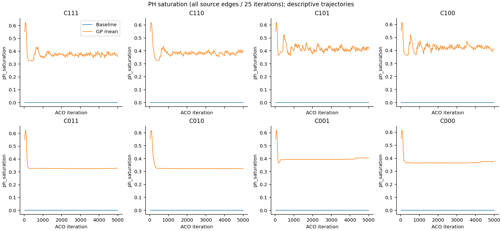

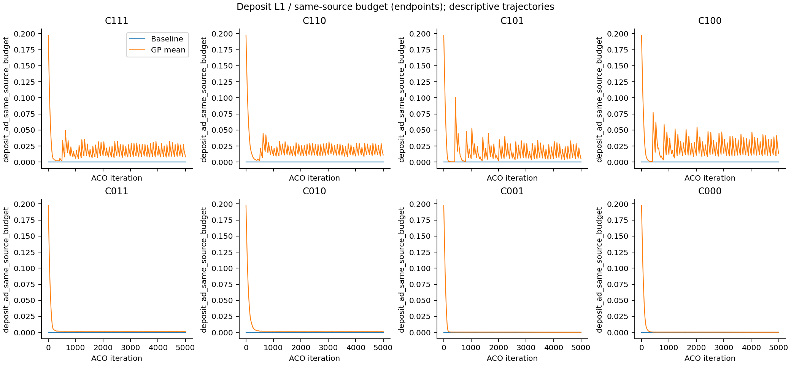

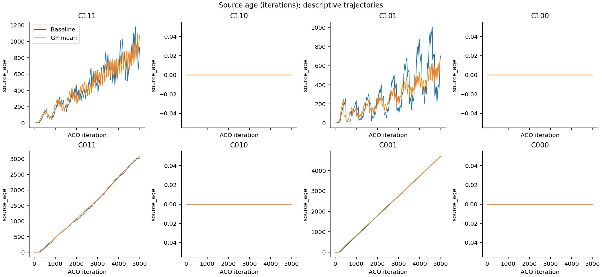

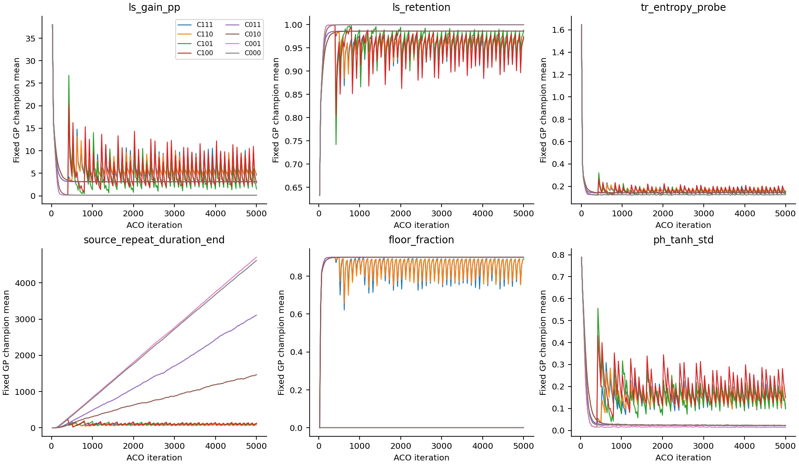

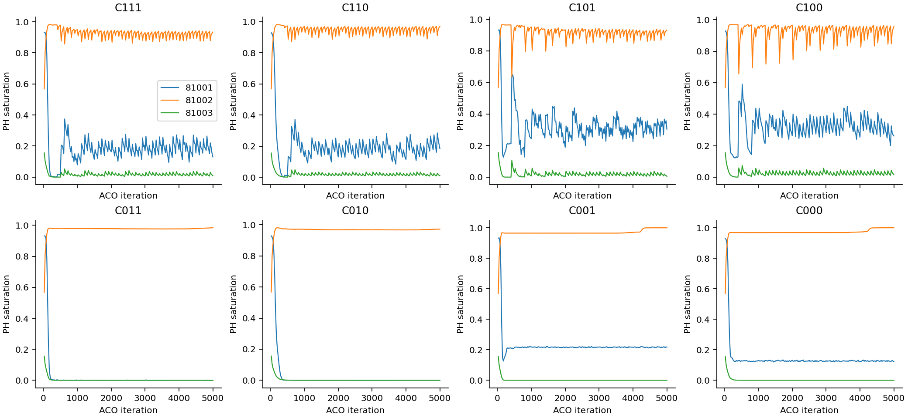

图 9–13：PH 输出、实际沉积、来源及 LS 过程。相同饱和率不代表相同沉积；源内归一化可以消除共同倍率。来源年龄、来源重复与熵的变化可以定位后续干预，但不能单独证明同一搜索盆地或有害停滞。MMAS-81001 和 81003 的 TR 为零树，因此不能把它们的全部收益差归因于学到的构造规则。

### 6.3 重启与缺失窗口

| 条件 | baseline 重启事件 | 涉及实例 | 100轮有效事件 | 100轮有效实例 | 100轮后变化 (pp) |
| --- | --- | --- | --- | --- | --- |
| C111 | 1106 | 32 | 1077 | 32 | 0.00000 |
| C110 | 400 | 26 | 392 | 26 | 0.00000 |
| C101 | 1278 | 32 | 1268 | 32 | -0.00047 |
| C100 | 852 | 32 | 830 | 32 | 0.00000 |
| C011 | 0 | 0 | 0 | 0 | — |
| C010 | 0 | 0 | 0 | 0 | — |
| C001 | 0 | 0 | 0 | 0 | — |
| C000 | 0 | 0 | 0 | 0 | — |

事件后变化先按求解、再按实例聚合，且只条件化于存在有效事件的实例。超过 5000 轮边界的窗口标为缺失，不补零。事件前后的改善不是重启的因果效应，因为没有固定时刻的无重启分叉。完整记录见 [重启事件](restart_events.csv) 与 [分模型汇总](restart_summary.csv)。

本轮未运行完整同状态分叉、TR-only/PH-only 全因子、重启回放或 AS 反向加回机制。因此不报告这些尚不存在的机制实验结果。

## 7. RQ5：审计成本与运行效率

### 7.1 同卡预热后的 100 轮验收

| 型号 | 算法 | 统计模式 | 无审计 (s) | 完整审计 (s) | 耗时倍数 | 输入 oracle |
| --- | --- | --- | --- | --- | --- | --- |
| NVIDIA RTX A4000 | as | centered_fp32 | 35.20485 | 52.32282 | 1.48624 | passed |
| NVIDIA RTX A4000 | as | centered_fp64 | 31.23986 | 47.85525 | 1.53187 | passed |
| NVIDIA RTX A4000 | as | legacy | 32.57061 | 47.53772 | 1.45953 | mismatch |
| NVIDIA RTX A4000 | mmas | centered_fp32 | 7.23059 | 15.76507 | 2.18033 | passed |
| NVIDIA RTX A4000 | mmas | centered_fp64 | 7.41796 | 16.33367 | 2.20191 | passed |
| NVIDIA RTX A4000 | mmas | legacy | 7.32128 | 15.96423 | 2.18053 | mismatch |
| NVIDIA RTX A5000 | as | centered_fp32 | 34.16207 | 49.46838 | 1.44805 | passed |
| NVIDIA RTX A5000 | as | centered_fp64 | 29.82980 | 45.01078 | 1.50892 | passed |
| NVIDIA RTX A5000 | as | legacy | 30.97196 | 42.41523 | 1.36947 | mismatch |
| NVIDIA RTX A5000 | mmas | centered_fp32 | 6.09232 | 15.42728 | 2.53225 | passed |
| NVIDIA RTX A5000 | mmas | centered_fp64 | 6.42335 | 15.10197 | 2.35110 | passed |
| NVIDIA RTX A5000 | mmas | legacy | 6.29227 | 16.25091 | 2.58268 | mismatch |
| NVIDIA RTX 4000 Ada Generation | as | centered_fp32 | 27.87490 | 44.72101 | 1.60435 | passed |
| NVIDIA RTX 4000 Ada Generation | as | centered_fp64 | 24.72685 | 41.10046 | 1.66218 | passed |
| NVIDIA RTX 4000 Ada Generation | as | legacy | 25.82222 | 40.92179 | 1.58475 | mismatch |
| NVIDIA RTX 4000 Ada Generation | mmas | centered_fp32 | 5.36831 | 15.50121 | 2.88754 | passed |
| NVIDIA RTX 4000 Ada Generation | mmas | centered_fp64 | 5.47947 | 15.68268 | 2.86208 | passed |
| NVIDIA RTX 4000 Ada Generation | mmas | legacy | 5.41813 | 14.40541 | 2.65874 | mismatch |

这些是 32 实例×baseline/三个冠军的短跑，两个记录配置已预热。完整审计具有明显成本，不能声称开销小于 5%。单次短跑不是稳定的性能排名，也不能据此声称统计 FP64 普遍快于 FP32。

### 7.2 5000 轮任务计时

| 组 | 型号 | 算法 | 统计模式 | 实例/任务 | 任务数 | 完整计时数 | 恢复/不完整计时 | 完整计时中位数 (s) |
| --- | --- | --- | --- | --- | --- | --- | --- | --- |
| N1 | NVIDIA RTX 4000 Ada Generation | as | centered_fp32 | 8 | 2 | 2 | 0 | 1255.06786 |
| N1 | NVIDIA RTX A5000 | as | centered_fp32 | 8 | 18 | 18 | 0 | 1542.21335 |
| N1 | NVIDIA RTX 4000 Ada Generation | as | centered_fp64 | 8 | 2 | 2 | 0 | 1104.68858 |
| N1 | NVIDIA RTX A5000 | as | centered_fp64 | 8 | 18 | 18 | 0 | 1351.00294 |
| N1 | NVIDIA RTX 4000 Ada Generation | as | legacy | 8 | 2 | 2 | 0 | 1090.96516 |
| N1 | NVIDIA RTX A5000 | as | legacy | 8 | 18 | 18 | 0 | 1340.23688 |
| N1 | NVIDIA RTX 4000 Ada Generation | mmas | centered_fp32 | 8 | 2 | 2 | 0 | 239.68852 |
| N1 | NVIDIA RTX A5000 | mmas | centered_fp32 | 8 | 18 | 18 | 0 | 269.48756 |
| N1 | NVIDIA RTX 4000 Ada Generation | mmas | centered_fp64 | 8 | 2 | 2 | 0 | 247.18389 |
| N1 | NVIDIA RTX A5000 | mmas | centered_fp64 | 8 | 18 | 17 | 1 | 286.29766 |
| N1 | NVIDIA RTX 4000 Ada Generation | mmas | legacy | 8 | 2 | 2 | 0 | 233.41375 |
| N1 | NVIDIA RTX A5000 | mmas | legacy | 8 | 18 | 17 | 1 | 262.74616 |
| P1 | NVIDIA RTX A5000 | mmas | legacy | 32 | 40 | 39 | 1 | 423.26522 |

最终 wall_seconds 可能只覆盖恢复后的最后一次执行。只有所有执行分块的阶段计时覆盖第 1–5000 轮时，才进入完整计时中位数。其他记录保留但不混入完整耗时。阶段计时和后台压缩可能重叠，不能简单相加。也不把批量 wall time 除以冠军数当作单模型部署延迟。

P1 计时跨八格条件汇总，仅用于描述本批工作负载；不是单一算法配置的 benchmark。不同型号分组，不混算硬件加速比。完整审计和首次编译等开销不冒充无审计部署性能。迁卡前记录及资源暂停另存归档，不当成新的独立重复。

## 8. 结论、证据缺口与后续用途

| 问题 | 当前可支持的回答 |
| --- | --- |
| H 是否影响当前 GP 的边际收益？ | 开发集历史实现的配对干预支持；相对变化主要来自 baseline 退化更多。 |
| R/F 可以认为无用吗？ | 不能。单项区间不足以排除作用，且存在背景依赖与交互。 |
| 数值缺陷是否已证明是 MMAS 收益小的主因？ | 没有。修正通过输入核验，但旧冠军质量未改善；仍需稳定环境重训。 |
| 历史强化是否与 GP 功能重叠？ | 尚不能证明。需要 TR/PH 分解、同状态干预或反向加回机制。 |
| GP 是否可替代 2-opt 或复制 MMAS 框架优势？ | 本轮没有对应的无 LS 学习和框架移植实验，不能回答。 |
| 能否证明 residual 优于直接重新设计状态转移？ | 本轮没有直接替换规则的训练对照，不能据此比较两种学习形式。 |
| 能否泛化到其他数据与重新训练？ | 不能。独立确认集、OOD、horizon 与重新训练尚缺相应证据。 |

本报告可以用于确定下一轮受控实验的优先级：先在数值稳定环境中重新训练并重新验收固定冠军，再验证历史来源的背景依赖和 TR/PH 贡献。若要解释 AS 与 MMAS 的差异，需要反向机制验证。不能仅因本轮观察到较大效应，就跳过独立确认或按结果选择数据。以上为后续研究建议，本次没有启动这些实验。

## 附录：复现与文件索引

冻结求解源码：`18e67cf8a3a6fff36c44bb1725e11823d9a60149c111222eeba78e0643eccab6`；快照登记提交：`f23033f1d7143068904a205ee4604e8a83ac79b6`。分析版本及文件 SHA256 见 [provenance.json](provenance.json)。源码快照的内容哈希优先于运行时工作树 HEAD。

本报告核验了 160 个质量子任务的诊断索引，共 81440 个引用文件，234.26 GB。该核验检查覆盖和文件完整性，不表示重新执行了所有数学 oracle。

另核验 18 个数值验收任务的正式诊断，共 270 个文件，4.15 GB；见 [验收日志完整性](validation_integrity.json)。预热记录不进入质量样本数。

- [统计参数与完整结果](statistics.json)、[逐求解质量](quality_per_solve.csv)、[八格统计](factorial.csv)。
- [数值验收](numeric_validation.csv)、[逐任务计时](timing_per_task.csv)、[完整诊断校验](integrity_audit.json)。
- [anytime 均值与区间](anytime_curves.csv)、[25轮窗口轨迹](mechanism_windows.csv)、[输出文件校验](report_manifest.json)。

```bash
CUDA_VISIBLE_DEVICES='' OMP_NUM_THREADS=1 OPENBLAS_NUM_THREADS=1 PYTHONPATH=src \
  .venv/bin/python -m control_experiments.mmas_ls.research_report --workers 4
```

首次执行读取完整诊断日志。后续仅当原始文件大小、mtime、ctime、索引和分析代码身份未变时复用校验缓存。派生机制缓存绑定诊断索引及分析代码。原始记录、旧门禁和冻结任务不会被重写。
