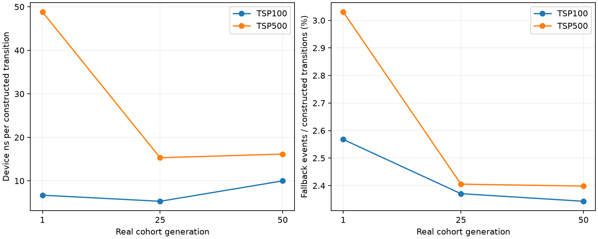
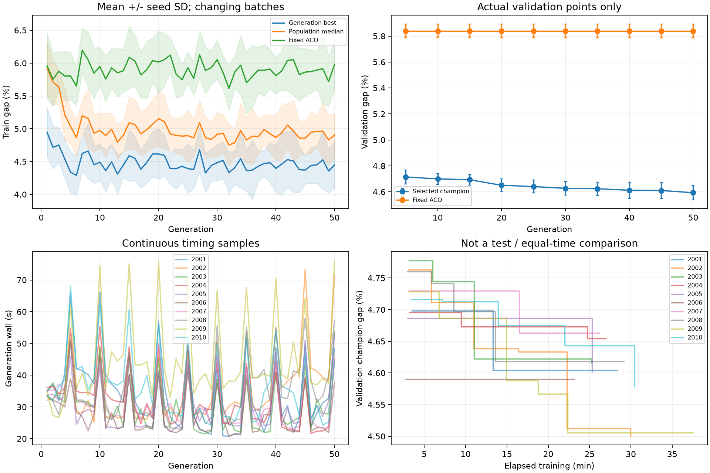

# 现有结果：六个RQ的证据与边界

证据等级：synthesis: see each source tier。生成时间：2026-10-10T03:18:21.586017+00:00。

本页是证据导航与分析，不是将pilot、formal和diagnostic合并成一个统计样本。所有质量指标为同FP32几何的标签gap%；标准测试未打开。

## RQ1：主要成本在哪里？

AS阶段事件如下。三个cohort分别测量，不对单次profiling计算置信区间。

| n | cohort代 | 构造秒 | 更新秒 | 构造占已记录阶段比例 |
|---|---:|---:|---:|---:|
| 100 | 1 | 32.74 | 1.70 | 95.05% |
| 100 | 25 | 25.10 | 1.63 | 93.89% |
| 100 | 50 | 48.00 | 1.64 | 96.70% |
| 500 | 1 | 1193.29 | 24.89 | 97.96% |
| 500 | 25 | 352.13 | 24.82 | 93.41% |
| 500 | 50 | 397.66 | 24.80 | 94.13% |

构造包含特征、树求值、选边及同步ACS局部更新，不能把整项称为GP时间。54项细粒度诊断进一步区分候选扫描、排名、统计和lane采样周期；见[按规模/宿主分面的诊断图](../../diagnostic/E01/p01/figures/detailed_work_and_sampled_cycles.svg)。这支持优先分析构造中的工作，而不是证明某个未实施优化有效。SM occupancy、DRAM、stall和spill流量缺失，不能以NVML利用率代替。

## RQ2：现有执行加速成立到什么程度？

| 对照 | 当前证据 | 允许的结论 |
|---|---|---|
| Python 1/8/16核 | 代码及功能检查已准备，完整计时缺失 | 暂不报告GPU/CPU倍数 |
| Numba 1/8/16核 | 同上 | 暂不判断CPU扩展或Numba收益 |
| GPU解释器/树JIT | 90预设配对block；3个争用block整体排除 | 可以比较当前GPU树专门化，不是CPU/新方法收益 |
| CPU-Opt、GPU-Tensor、M1/M2/M3 | 未完成 | 不填推测值 |

AS的同卡配对结果：

| n | cohort代 | 干净block | JIT秒中位数 | 解释器/JIT配对中位比 |
|---|---:|---:|---:|---:|
| 100 | 1 | 5/5 | 34.03 | 1.277 |
| 100 | 25 | 5/5 | 26.93 | 1.407 |
| 100 | 50 | 5/5 | 50.70 | 1.181 |
| 500 | 1 | 5/5 | 1247.30 | 1.071 |
| 500 | 25 | 5/5 | 391.36 | 2.269 |
| 500 | 50 | 4/5 | 412.81 | 2.121 |

完整三宿主结果与探索性配对区间见[E04](../../pilot/E04/p01/README.md)。时间为完整预算的暖评价，编译预热另列，不是完整训练加速比。

## RQ3：怎样组织GPU映射？

固定active=3200时，相对lanes8的配对时间比如下；大于1表示被比较计划更快。这里只展示预定固定计划，不在holdout选正式赢家。

| n | cohort代 | lanes4 比值 | lanes16 比值 | lanes32 |
|---|---:|---:|---:|---|
| 100 | 1 | 1.248 | 0.742 | 寄存器资源下不可启动 |
| 100 | 25 | 1.253 | 0.701 | 寄存器资源下不可启动 |
| 100 | 50 | 1.592 | 0.762 | 寄存器资源下不可启动 |
| 500 | 1 | 1.243 | 0.913 | 寄存器资源下不可启动 |
| 500 | 25 | 1.087 | 0.693 | 寄存器资源下不可启动 |
| 500 | 50 | 0.878 | 0.671 | 寄存器资源下不可启动 |

[TSP100热图](../../pilot/E07/p01/figures/tsp100_fixed_mapping.svg)及[TSP500热图](../../pilot/E07/p01/figures/tsp500_fixed_mapping.svg)显示映射与cohort存在交互。增大每蚂蚁线程数不保证更快；不可行也不能记为零时间。两个污染a01保留，独立修复队列的a02只能替代同一block，不能增加重复数。这不是完整M3选择器验证。

## RQ4：TSP500为什么更慢？

| n | cohort代 | 搜索秒中位数 | ns/构造transition | fallback事件% | 采样显存GiB |
|---|---:|---:|---:|---:|---:|
| 100 | 1 | 34.02 | 6.71 | 2.57 | 0.96 |
| 100 | 25 | 26.92 | 5.31 | 2.37 | 0.96 |
| 100 | 50 | 50.68 | 10.00 | 2.34 | 0.96 |
| 500 | 1 | 1247.25 | 48.82 | 3.03 | 7.03 |
| 500 | 25 | 391.31 | 15.32 | 2.41 | 7.03 |
| 500 | 50 | 412.75 | 16.16 | 2.40 | 7.03 |

n从100到500，单条路径的构造步数从99到499，密集状态矩阵容量约随n²增长。每transition成本、回退率和cohort也在变化，因此不能只用5倍路径长度解释总耗时。AS初代JIT收益较小，后期收益明显增大；TSP500并非始终比TSP100的相对收益小。后期两规模的GP已经分别进化，这不是只改变n的纯因果干预。当前证据支持继续做固定程序/状态、资源布局和排名工作干预，尚不能断言唯一原因是显存带宽。正式seed2004的慢运行保留，不因它慢就删除。旧双树/FP64历史结果另列[E02](../../historical/E02/p01/README.md)，不作直接配对分母。

## RQ5：更快是否让算法设计更好？

当前能回答固定GPU对照能否学到有效规则，不能回答新加速方法的等时间收益。正式TSP100的10根seed结果如下。

| 指标 | 均值 | 根seed SD | 95%根seed bootstrap区间 |
|---|---:|---:|---|
| validation_gap | 4.5932 | 0.0543 | [4.5603, 4.6232] |
| validation_baseline_gap | 5.8400 | 0.0533 | [5.8073, 5.8692] |
| validation_delta_pp | -1.2468 | 0.0561 | [-1.2784, -1.2126] |
| training_s | 1694.1180 | 240.1302 | [1567.0552, 1843.4220] |
| preparation_s | 47.0570 | 3.1712 | [45.4629, 49.2373] |

训练展示本代最好和中位数，并保留随batch波动的ACO对照；验证展示规定代的已选冠军，不补造中间验证点。验证改善不能代替最终测试，也不能消除反复验证选择的偏差。TSP500是否齐全见[正式覆盖表](../../formal/E09/p01/README.md)，不对未完成集合发布总体均值。三seed先导单列，不能与正式seed相加。

## RQ6：能迁移到不同宿主和硬件吗？

| 型号 | n | 干净block | 默认秒 | 独立调优后秒 | 默认/调优配对比 |
|---|---:|---:|---:|---:|---:|
| a40 | 100 | 5/5 | 29.95 | 24.83 | 1.206 |
| a40 | 500 | 4/5 | 1022.35 | 876.18 | 1.167 |
| a5000 | 100 | 5/5 | 33.52 | 27.07 | 1.238 |
| a5000 | 500 | 5/5 | 1214.19 | 977.35 | 1.242 |
| l4 | 100 | 5/5 | 32.01 | 25.58 | 1.252 |
| l4 | 500 | 5/5 | 1225.08 | 962.36 | 1.273 |
| l40s | 100 | 5/5 | 11.37 | 9.24 | 1.231 |
| l40s | 500 | 5/5 | 447.35 | 400.19 | 1.118 |
| pro5000 | 100 | 5/5 | 13.18 | 10.25 | 1.285 |
| pro5000 | 500 | 5/5 | 383.69 | 383.71 | 1.000 |

[跨GPU图与资源、能耗、逐位一致性、统一冠军审计表](../../pilot/E12/p01/README.md)已分开导出。每型号只有一张实际卡，不能解释为型号总体的独立硬件重复。FP32跨架构可能产生不同闭环路径；规范审计不重新选择冠军。现有三宿主性能是固定AS程序跨宿主执行，不等于三宿主独立训练都有效。

## p02将补充什么？

新增2-opt/3-opt执行器同语义对照、构造/LS/更新成本，以及三宿主各自联合训练。问题是执行速度及GP相对于同LS的ZERO基准是否改善，不预设结果必然正向。12配置先通过资格、调优和三代smoke，再放行36次50代pilot。标准测试、10seed LS确认性实验和等时间政策仍未解锁。

## 图表

- [rq4_scale_and_cohort](figures/rq4_scale_and_cohort.svg)

CSV/JSON在tables；图同时提供PDF/SVG/PNG。输入身份和筛选规则见provenance.json。标准测试未打开。
